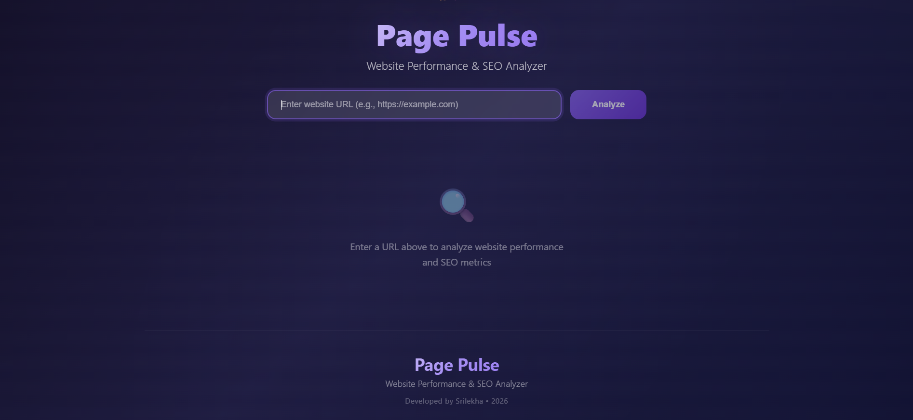
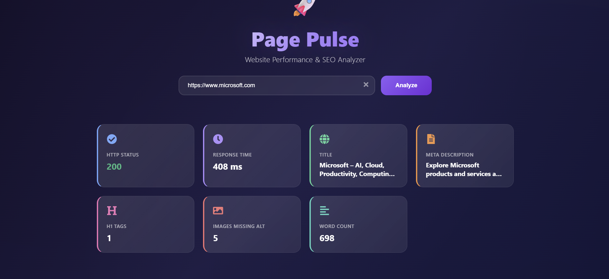
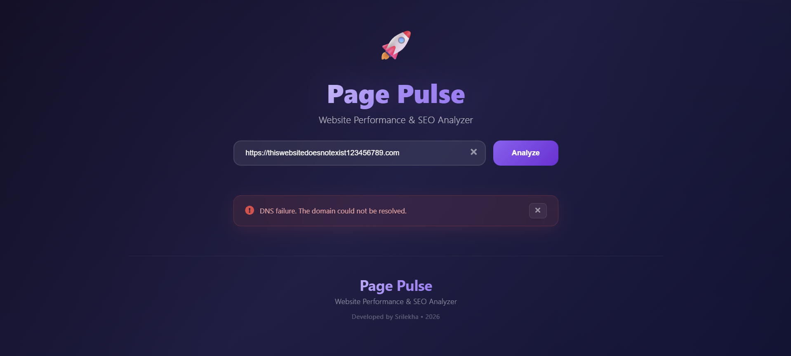

# 🚀 Page Pulse

## Overview

Page Pulse is a full-stack website analysis tool built as part of the Digital Heroes Software Development Internship assignment. The application takes a website URL as input, fetches the page, and displays key SEO and performance metrics in a clean dashboard interface.

The project consists of a React frontend with a glass-morphism design and a Node.js/Express backend that uses Cheerio for HTML parsing. It handles common edge cases like invalid URLs, unreachable websites, and sites that block automated requests.

## Features

- Analyze any public website by entering a URL
- Display HTTP status code of the response
- Show response time in milliseconds
- Extract and display page title
- Extract and display meta description
- Count number of H1 tags on the page
- Count images missing alt text for accessibility
- Calculate total word count of the page content
- URL validation with proper error messages
- Error handling for timeouts, DNS failures, and 403 responses
- Responsive UI that works on desktop and mobile devices

## Tech Stack

**Frontend:**
- React 18
- Vite
- Axios
- CSS (no frameworks)

**Backend:**
- Node.js
- Express.js
- Axios
- Cheerio

## 📂 Project Structure

```text
page-pulse/
├── client/
│   ├── public/
│   │   └── vite.svg
│   ├── src/
│   │   ├── assets/
│   │   ├── components/
│   │   │   ├── Footer.jsx
│   │   │   ├── Header.jsx
│   │   │   ├── LoadingSpinner.jsx
│   │   │   ├── ReportCard.jsx
│   │   │   ├── SearchBar.jsx
│   │   │   └── SeoMetrics.jsx
│   │   ├── services/
│   │   │   └── api.js
│   │   ├── App.css
│   │   ├── App.jsx
│   │   ├── index.css
│   │   └── main.jsx
│   ├── .gitignore
│   ├── index.html
│   ├── package.json
│   ├── package-lock.json
│   └── vite.config.js
│
├── server/
│   ├── controllers/
│   │   └── auditController.js
│   ├── routes/
│   │   └── auditRoutes.js
│   ├── services/
│   │   └── auditService.js
│   ├── utils/
│   ├── app.js
│   ├── server.js
│   ├── package.json
│   ├── package-lock.json
│   ├── .env
│   └── .gitignore
│
├── .gitignore
└── README.md
```
## Installation

### Prerequisites
- Node.js (v16 or higher)
- npm

### Backend Setup

```bash
cd server
npm install
npm run dev
```

The backend will run on:
`http://localhost:5000`

Frontend Setup
bash
cd client
npm install
npm run dev
The frontend will run on http://localhost:5173

Environment Variables
Create a .env file in the server directory:

text
PORT=5000
CLIENT_URL=http://localhost:5173
Create a .env file in the client directory:

text
VITE_API_URL=http://localhost:5000/api
API
POST /api/analyze
Accepts a URL and returns website analysis data.

Request:

json
{
  "url": "https://example.com"
}
Success Response (200):

json
{
  "success": true,
  "report": {
    "status": 200,
    "responseTime": "350 ms",
    "title": "Example Domain",
    "metaDescription": "This domain is for use in illustrative examples...",
    "h1Count": 1,
    "imagesWithoutAlt": 0,
    "wordCount": 17
  }
}
Error Responses:

Status	Message
400	Invalid URL format
400	DNS failure. The domain could not be resolved.
400	The URL does not point to an HTML page.
403	This website blocks automated requests (HTTP 403 Forbidden).
503	Website is currently unreachable.
504	Request timed out.
Error Response Format:

json
{
  "success": false,
  "message": "Error description"
}
Screenshots
Home Page


Analysis Result


Error Handling


Challenges Faced
CORS Issues
Configuring CORS properly between the frontend and backend required setting up the correct origin headers and using a proxy during development.

URL Validation
Handling various URL formats and edge cases required careful validation logic to ensure only valid HTTP/HTTPS URLs are processed.

Handling Websites That Block Bots
Some websites like openai.com return 403 Forbidden errors. I added specific handling for this case to display a clear error message to users.

Error Handling
Implementing comprehensive error handling for network failures, timeouts, DNS errors, and server errors required testing with multiple failure scenarios.

React Component Structure
Organizing components in a clean, reusable way while managing state between the search bar, results display, and error alerts took some planning.

Future Improvements
Add an SEO score calculation based on collected metrics

Integrate with Lighthouse API for performance scoring

Add PDF export functionality for reports

Include performance charts and visualizations

Add more SEO metrics like Open Graph tags and meta keywords

Implement user authentication and history tracking

Add support for scheduled audits

AI Usage
AI tools were used to assist with debugging, reviewing code, improving UI components, and refining error handling strategies. The implementation, testing, project structure, and final submission were completed and verified by me.
